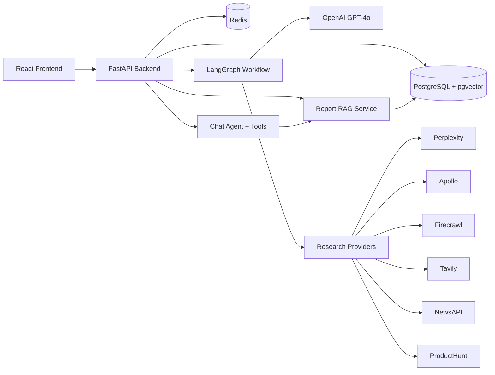

# Architecture

## System Overview

ProspectLens is a three-tier application:

| Tier | Role |
|------|------|
| **Frontend** | React 18 + TypeScript + Vite — session management, report dashboards, SSE progress, follow-up chat |
| **Backend** | FastAPI + SQLAlchemy — REST API, workflow orchestration, chat agent, RAG indexing |
| **AI layer** | LangGraph workflow — multi-provider research, analysis, QC, structured report generation |

**Persistence:** PostgreSQL 16 with **pgvector** (reports, sessions, chat, workflow events, RAG embeddings).

**Cache:** Redis (research deduplication, report chat context, node output idempotency) with in-memory fallback.



## Data Flow

1. User creates a research session (company, website, objective) via the frontend.
2. Frontend calls `POST /api/v1/sessions/{id}/run`.
3. Backend runs the compiled LangGraph via `graph.astream()` as an async background task (`workflow_service.py`).
4. Each node executes through the graph (with conditional retry loop after quality check); observability wrappers emit SSE/DB events per node.
5. Node events persist to `workflow_events` and stream to the UI via SSE.
6. The final structured report saves to `reports.content` (JSONB).
7. Report chunks are embedded and indexed into `report_rag_chunks` (pgvector).
8. Redis caches a pre-built report context string for fast chat bootstrapping.
9. User views the 10-section dashboard briefing, exports PDF, or asks follow-up questions grounded in RAG + cached context.

## LangGraph Workflow

### Shared State (`ResearchState`)

All nodes read/write a shared `TypedDict` containing session metadata, intermediate outputs, quality scores, section coverage, recovery hints, and accumulated token/cost metrics.

### Nodes

| Node | Primary provider(s) | Input | Output |
|------|---------------------|-------|--------|
| **Planner** | OpenAI | Company + objective | Research plan with targeted queries |
| **Research** | Perplexity, Tavily, Firecrawl, Apollo, NewsAPI, ProductHunt | Plan queries + website | Sanitized research items with provider tags |
| **Analyze** | OpenAI | Raw research | Structured business analysis (signals, risks, ICP, competitors, metrics) |
| **Quality Check** | OpenAI + deterministic coverage | Research + analysis | Hybrid quality score, issues, `section_coverage` |
| **Recovery** | OpenAI | QC gaps | Gap-targeted queries only (conditional) |
| **Report Generator** | OpenAI (multi-call pipeline) | All prior outputs + Apollo firmographics | 10-section structured JSON report |
| **Report Validation** | Deterministic + LLM | Generated report | Coverage fixes, unknowns, final normalization |

### Conditional Routing

After **Quality Check**:

- If `quality_score >= 0.75` **or** `retry_count >= 2` → **Report Generator**
- Otherwise → **Recovery** → **Research** (retry loop)

After **Report Generator** → **Report Validation** → END.

### Checkpointing & Resume

The compiled graph uses `AsyncPostgresSaver` (`langgraph-checkpoint-postgres`). Each session maps to a LangGraph `thread_id` equal to the session UUID.

| Action | Endpoint | Behavior |
|--------|----------|----------|
| Fresh run | `POST /sessions/{id}/run` | Clears checkpoint thread, streams from planner |
| Full restart | `POST /sessions/{id}/retry` | Same as fresh run after failure |
| Resume | `POST /sessions/{id}/resume` | `astream(None, config)` from last checkpoint |
| Checkpoint status | `GET /sessions/{id}/workflow/state` | `next_nodes`, `can_resume` |

On mid-run failure the checkpoint is preserved so resume can continue. Post-graph finalize (save report, RAG index) runs on successful completion or when the graph is already at END but finalize previously failed.

#### Failure & resume behavior

| Scenario | Session status | Checkpoint | User action |
|----------|----------------|------------|-------------|
| Node throws mid-run | `failed` | Preserved (`can_resume: true`) | **Resume workflow** or **Restart from scratch** |
| Backend killed mid-run | `running` or `failed` | Preserved | **Resume workflow** (UI on Sessions detail + Follow-up Chat N/A until complete) |
| Graph finished, finalize failed (DB/RAG) | `failed` | At END (`can_resume: false`) | **Resume** runs finalize only (report save + RAG index) |
| Successful completion | `completed` | Remains at END | N/A |
| Fresh run or retry | `running` | Thread cleared first | Full pipeline from planner |

**QC recovery loop** (in-graph, not checkpoint resume): low quality score routes to Recovery → Research again (up to `retry_count >= 2`), then proceeds to report generation.

#### How to demo resume (manual QA)

1. Start a workflow: `POST /api/v1/sessions/{id}/run` or UI **Run**.
2. While status is `running`, stop the backend (`docker stop zylabs-backend-1`) or wait for a provider timeout.
3. Check checkpoint: `GET /api/v1/sessions/{id}/workflow/state` → `has_checkpoint: true`, `can_resume: true`, `next_nodes` lists remaining graph nodes.
4. Restart backend, then either:
   - **API:** `POST /api/v1/sessions/{id}/resume`
   - **UI:** open session → **Resume workflow** (failed/stuck sessions on Details or Workflow tab)
5. Confirm SSE shows `workflow` event `resumed` and only **remaining** nodes execute (planner/research not re-run).
6. For a full restart: **Restart from scratch** / `POST /retry` clears the checkpoint thread.

Automated checkpoint test: `backend/tests/test_checkpoint_resume.py` (MemorySaver). E2E script: `backend/scripts/e2e_microsoft_test.py` logs `can_resume` during polling.

### Research Providers

Research runs in parallel where API keys are configured:

| Provider | Purpose |
|----------|---------|
| Perplexity | Web research with citations |
| Tavily | Supplemental web search |
| Firecrawl | Site map, scrape, crawl, search on company website |
| Apollo | Firmographics (founded, HQ, employees, funding, valuation) |
| NewsAPI | Recent news articles |
| ProductHunt | Product/launch signals |

Failed provider responses are filtered during research sanitation so thin/error payloads do not pollute downstream nodes.

### Quality Check (Hybrid QC)

Combines:

1. **Deterministic section coverage** — checks that analysis/report prerequisites exist per section.
2. **LLM quality review** — scores completeness, citation quality, and actionability.

`section_coverage` is promoted to workflow state and drives targeted recovery queries on retry (gap-only, not full re-research).

## Report Pipeline

The **Report Generator** node delegates to `report_pipeline/pipeline.py`, which:

1. Extracts deterministic data (Apollo firmographics, sources, products, snapshot fields).
2. Runs parallel LLM calls for section overviews (company, products, customers, stakeholders, signals, risks, discovery, outreach, unknowns, sources).
3. Merges Apollo + regex + LLM outputs into `company_snapshot` and `*_overview` blocks.
4. Normalizes via `normalize_report_content` before persistence.

Key extractors live in `report_pipeline/extractors.py`; prompts in `report_pipeline/prompts.py`.

### Report Sections (10)

| # | Section | Dashboard component |
|---|---------|---------------------|
| 1 | Company Overview | `CompanyOverviewDashboard` |
| 2 | Products & Services | `ProductsServicesDashboard` |
| 3 | Target Customers | `TargetCustomersDashboard` |
| 4 | Stakeholders | `StakeholdersDashboard` |
| 5 | Business Signals | `BusinessSignalsDashboard` |
| 6 | Risks & Challenges | `RisksChallengesDashboard` |
| 7 | Discovery Questions | `DiscoveryQuestionsDashboard` |
| 8 | Outreach Strategy | `OutreachStrategiesDashboard` |
| 9 | Unknowns | `UnknownsDashboard` |
| 10 | Sources | `SourcesDashboard` |

Frontend utilities in `structured-report-utils.ts` build overview fallbacks when legacy report shapes are missing fields.

### Export & Full Report View

- **View Full Report** — `ReportFullView` dialog renders all sections in one scrollable view.
- **Export PDF** — `report-export.ts` opens a print-styled HTML window; user saves via browser Print → PDF.
- Shared actions wired through `ReportActionsContext` and `ReportSectionHeader` on every dashboard.

## Report RAG (pgvector)

Semantic retrieval over completed briefings powers chat grounding.

| Component | Detail |
|-----------|--------|
| Model | OpenAI `text-embedding-3-small` (1536 dimensions) |
| Storage | `report_rag_chunks` table with `vector(1536)` column |
| Indexing | On workflow completion in `workflow_service.py` |
| Retrieval | Cosine distance via pgvector SQL + distance threshold filter |
| Chunking | Section-aware chunks (~1200 chars) from structured report JSON |

Chat flow:

1. `ensure_indexed` rebuilds chunks if the session report changed.
2. `retrieve` fetches top-k relevant chunks for the user query.
3. Retrieved sections are injected into the chat system prompt.
4. The `search_report` chat tool exposes the same retrieval to the agent.

**Startup:** `main.py` runs `CREATE EXTENSION IF NOT EXISTS vector` before `create_all`. Alembic migration `003_pgvector_rag_chunks` mirrors the schema for production deploys.

## Follow-up Chat

| Piece | Implementation |
|-------|----------------|
| Agent | LangChain tool-calling loop in `chat_agent.py` |
| Context | Redis `report_ctx:{session_id}` + RAG chunks + last N messages |
| Tools | 6 optional tools (see below) |

### Chat Tools

| Tool ID | Provider | Use case |
|---------|----------|----------|
| `search_report` | pgvector RAG | Answer from briefing first |
| `web_search` | Tavily | Live facts not in report |
| `company_enrichment` | Apollo | Revenue, headcount, funding, HQ |
| `recent_news` | NewsAPI | Latest announcements |
| `deep_research` | Perplexity | Synthesized research with citations |
| `scrape_website` | Firecrawl | Read a specific company page |

Users can enable tools per message; the agent may also auto-select tools when appropriate.

## Context Caching (Redis)

| Key pattern | TTL | Purpose |
|-------------|-----|---------|
| `research:{hash}` | 24h | Skip duplicate provider calls |
| `report_ctx:{session_id}` | 7d | Pre-built chat context string |
| `node_output:{session_id}:{node}` | 24h | Idempotent retry support |

Falls back to in-process dict when Redis is unavailable.

## Database Schema

| Table | Purpose |
|-------|---------|
| `research_sessions` | Session metadata, workflow status, cost metrics |
| `reports` | Final structured report JSON (`content` JSONB) |
| `chat_messages` | Follow-up conversation (`metadata` JSONB for tools/RAG info) |
| `workflow_events` | Per-node observability (tokens, cost, duration, payload) |
| `report_rag_chunks` | Sectioned text + `vector(1536)` embeddings per session |

## Observability

- **LangSmith** — automatic tracing when `LANGSMITH_TRACING=true`
- **Workflow events DB** — every node transition persisted
- **SSE stream** — real-time progress to the frontend stepper
- **Structured logging** — JSON logs via structlog with session/node context
- **Cost tracker** — per-session token and USD aggregation (workflow + chat tools)

## API Surface (high level)

| Area | Prefix | Notes |
|------|--------|-------|
| Sessions | `/api/v1/sessions` | CRUD, run workflow |
| Workflow | `/api/v1/sessions/{id}/events` | SSE event stream |
| Workflow | `/api/v1/sessions/{id}/resume` | Resume from Postgres checkpoint |
| Workflow | `/api/v1/sessions/{id}/workflow/state` | Checkpoint summary |
| Chat | `/api/v1/sessions/{id}/chat` | Follow-up messages |
| Chat tools | `/api/v1/chat/tools` | List available tools |
| Usage | `/api/v1/usage` | Token/cost summaries |
| Health | `/health` | Liveness check |

## Frontend Architecture

```
frontend/src/
├── prospectlens/report-briefing/   # Dashboard components per section
├── lib/structured-report-utils.ts # Overview builders + fallbacks
├── lib/report-export.ts          # PDF export via print HTML
├── types/structured-report.ts    # Report TypeScript types
└── pages/reports/                # Report workspace + workflow board
```

Report workspace uses TanStack Query for session/report data and SSE hooks for live workflow progress.
