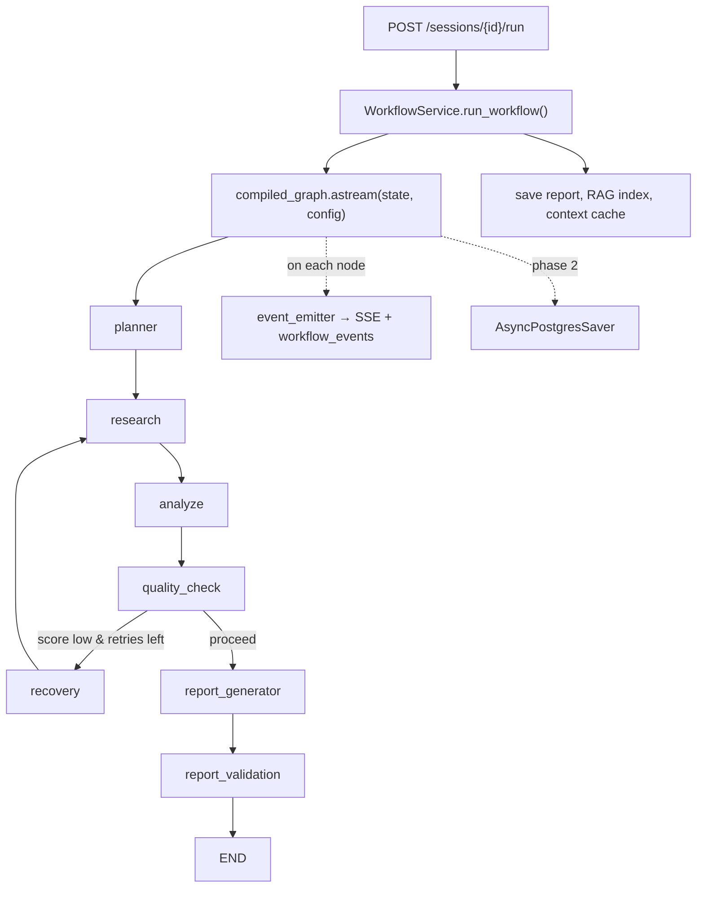

# Plan: Native LangGraph Execution

Migrate from **manual node orchestration** in `workflow_service.py` to **native LangGraph `astream` / `ainvoke`** while preserving SSE events, DB persistence, and the existing recovery loop.

**Current state:** `graph.py` defines the correct 7-node graph with conditional routing, but `workflow_service.run_workflow()` duplicates that logic with a `for` loop + `while True` + `_run_node_with_events()`.

**Target state:** `compile_graph()` is the single source of truth for traversal; `workflow_service` only handles I/O (DB, SSE, RAG, cache).

---

## Goals

| Goal | Why |
|------|-----|
| Execute via `graph.astream()` | Satisfies assignment LangGraph rubric |
| Keep per-node SSE + `workflow_events` | Frontend progress UI unchanged |
| Preserve QC → recovery loop | Already modeled in `graph.py` edges |
| Add Postgres checkpointer (phase 2) | Crash resume, true recoverability |
| No behavior regression | Same reports, tokens, costs |

## Non-goals (this migration)

- Changing node business logic (planner, research, report pipeline)
- Job queue / Celery
- User-scoped sessions
- Report-pipeline sub-step SSE (separate follow-up)

---

## Architecture (target)



---

## Phase 1 — Native stream (P0, ~1 day)

**Outcome:** `run_workflow()` calls LangGraph; manual `NODE_ORDER` loop deleted.

### 1.1 Add observability wrappers (recommended)

Create `backend/app/graph/observability.py`:

```python
def observable_node(node_name: str, node_fn):
    async def wrapped(state: dict) -> dict:
        session_id = UUID(state["session_id"])
        t0 = time.time()
        await emit_started(session_id, node_name)
        try:
            updates = await node_fn(state)
            await emit_completed(session_id, node_name, state, updates, t0)
            return updates
        except Exception as exc:
            await emit_failed(session_id, node_name, exc, t0)
            raise
    return wrapped
```

Register wrapped nodes in `build_graph()` instead of raw functions:

```python
graph.add_node("planner", observable_node("planner", planner_node))
# ... all 7 nodes
```

**Why wrappers vs stream-only:** Wrappers keep event timing identical to today (started → work → completed) and work with both `astream` and `ainvoke`. Move logic from `_run_node_with_events` into `emit_*` helpers.

### 1.2 Replace manual loop in `workflow_service.py`

Delete lines ~71–94 (manual `for` + `while True` + per-node calls).

Replace with:

```python
graph = self.get_graph()
config = {"configurable": {"thread_id": str(session_id)}}  # prep for phase 2

final_state = dict(state)
async for chunk in graph.astream(state, config=config, stream_mode="updates"):
    for node_name, updates in chunk.items():
        final_state = {**final_state, **updates}
        logger.info("graph_node_completed", node=node_name, session_id=str(session_id))
```

Post-processing (unchanged): save report, RAG index, context cache, workflow completed event.

### 1.3 Verify state merge semantics

LangGraph shallow-merges node return values into state. Confirm these fields still work:

| Field | Merge behavior | Action |
|-------|----------------|--------|
| `raw_research` | Node returns full list | OK — `research_node` appends on retry internally |
| `node_outputs` | Node copies dict + updates key | OK — already manual merge in each node |
| `total_tokens` / `total_cost_usd` | Node returns accumulated totals | OK |
| `retry_count` | Incremented in `recovery_node` | OK |
| `research_plan` | Replaced with updated plan | OK |

**No reducers required** unless we later split nodes to return deltas only.

### 1.4 Delete dead code

- Remove `_run_node_with_events`
- Remove `NODE_ORDER` constant
- Remove inline `from app.graph.nodes.quality import route_after_quality` in service
- Keep `route_after_quality` tests — still used by graph edges

### 1.5 Tests

| Test | File |
|------|------|
| Graph compiles with 7 nodes | `tests/test_graph.py` |
| Mock all nodes → `ainvoke` reaches END | new `tests/test_graph_execution.py` |
| Low QC score triggers recovery path (mock nodes) | same |
| `retry_count >= 2` forces report path | same |

Use `unittest.mock.patch` on node functions before `compile_graph()` or inject mock graph for unit tests.

### 1.6 Manual QA checklist

- [ ] Create session → all 7 nodes appear in SSE stepper/trace
- [ ] Recovery loop fires when QC low (test with thin company)
- [ ] Report saves; chat RAG indexes
- [ ] Failed node marks session FAILED + emits `failed` event
- [ ] Retry endpoint still works

---

## Phase 2 — Postgres checkpointer (P1, ~1–2 days)

**Outcome:** Workflow survives backend restart; can resume from last completed node.

### 2.1 Dependency

```toml
# pyproject.toml
"langgraph-checkpoint-postgres>=2.0.0",
```

### 2.2 Schema

LangGraph checkpointer creates its own tables (`checkpoints`, `checkpoint_blobs`, etc.) on `setup()`.

In `main.py` lifespan:

```python
from langgraph.checkpoint.postgres.aio import AsyncPostgresSaver

async with AsyncPostgresSaver.from_conn_string(settings.database_url_sync) as checkpointer:
    await checkpointer.setup()
    app.state.checkpointer = checkpointer
```

Use sync URL variant or `psycopg` pool — follow LangGraph docs for async FastAPI.

### 2.3 Compile with checkpointer

```python
def compile_graph(checkpointer=None):
    return build_graph().compile(checkpointer=checkpointer)
```

Pass `checkpointer` from `app.state` into `WorkflowService` at startup.

### 2.4 Thread ID = session ID

```python
config = {"configurable": {"thread_id": str(session_id)}}
```

### 2.5 Resume API (optional but strong demo)

```python
# GET /sessions/{id}/workflow/state — last checkpoint summary
# POST /sessions/{id}/resume — graph.ainvoke(None, config) from checkpoint
```

On crash: session stays `RUNNING`; resume continues from checkpoint instead of full retry.

### 2.6 Retry semantics

| Today | After checkpoint |
|-------|------------------|
| `retry` = full pipeline restart | `resume` from last node OR explicit `restart` flag |

Keep `POST /retry` as full restart; add `POST /resume` for checkpoint continue.

---

## Phase 3 — Stream events to SSE (P1, ~0.5 day)

**Outcome:** Optional finer-grained progress without wrappers duplicating work.

Use LangGraph `astream_events` (v2) for LangSmith-aligned traces:

```python
async for event in graph.astream_events(state, config=config, version="v2"):
    if event["event"] == "on_chain_end" and event.get("name") in NODE_NAMES:
        # map to workflow_events payload
```

**Decision:** Use wrappers (phase 1) for product SSE; add `astream_events` logging to LangSmith in phase 3. Don't duplicate both unless needed.

---

## Phase 4 — Frontend alignment (P2, ~0.5 day)

- Extend `WorkflowProgress.tsx` steps: add **Recovery** + **Report Validation**
- Map `NODE_ORDER` in frontend to match graph node names
- Research workflow board: either emit report sub-steps as custom events or relabel UI to match single `report_generator` node

---

## File change map

| File | Change |
|------|--------|
| `app/graph/graph.py` | Wrap nodes with `observable_node`; accept `checkpointer` in `compile_graph` |
| `app/graph/observability.py` | **New** — event emit helpers extracted from workflow_service |
| `app/services/workflow_service.py` | Replace manual loop with `astream`; slim to ~120 lines |
| `app/main.py` | Init checkpointer (phase 2); pass to workflow service |
| `app/api/workflow.py` | Optional `POST /resume` (phase 2) |
| `tests/test_graph_execution.py` | **New** — integration tests with mocked nodes |
| `docs/architecture.md` | Update data flow diagram |
| `docs/engineering-decisions.md` | Resolve Decision 2 tech debt |

---

## Risk register

| Risk | Mitigation |
|------|------------|
| Event timing differs from today | Wrappers mirror `_run_node_with_events` exactly |
| Recovery loop runs extra times | Graph edges match current logic; add test with `retry_count` |
| Checkpointer DB URL mismatch | Use same Postgres; add `database_url_sync` to config |
| Long-running report node blocks SSE | Keep ping events in SSE generator (unchanged) |
| Token delta in events wrong | Compute `updates["total_tokens"] - prev` in wrapper using pre-state |
| Docker missing new dep | Rebuild image after `pyproject.toml` change |

---

## Rollout strategy

1. **Feature flag** (optional): `USE_NATIVE_GRAPH=true` env var toggles old vs new path for one release
2. **Default on** after QA passes
3. **Delete** manual path in same PR or follow-up immediately

Recommended: skip flag for assignment repo — single PR with tests is fine.

---

## Effort summary

| Phase | Effort | Rubric impact |
|-------|--------|---------------|
| 1 — Native `astream` + wrappers | 1 day | LangGraph: partial → strong |
| 2 — Postgres checkpointer | 1–2 days | LangGraph recoverability: B → A |
| 3 — `astream_events` / LangSmith | 0.5 day | AI observability |
| 4 — Frontend stepper | 0.5 day | Frontend polish |

**Minimum for assignment demo:** Phase 1 only.  
**Strong submission:** Phase 1 + 2.

---

## Success criteria

- [ ] `workflow_service.py` does not import individual node functions
- [ ] `graph.astream()` or `graph.ainvoke()` is the only execution path
- [ ] Conditional routing lives only in `graph.py` (not duplicated in service)
- [ ] All existing `tests/test_graph.py` pass + new execution tests pass
- [ ] Demo: visible recovery loop in trace when QC fails
- [ ] (Phase 2) Kill backend mid-report → resume completes without re-running planner

---

## Implementation order (checklist)

```
[ ] 1. Extract emit_started/completed/failed from workflow_service → graph/observability.py
[ ] 2. Add observable_node wrapper; register in build_graph()
[ ] 3. Replace manual loop with graph.astream(stream_mode="updates")
[ ] 4. Remove _run_node_with_events, NODE_ORDER, duplicate routing
[ ] 5. Add test_graph_execution.py with mocked nodes
[ ] 6. Manual QA on Docker stack
[ ] 7. Update architecture.md + engineering-decisions.md
[ ] 8. (Phase 2) Add langgraph-checkpoint-postgres + resume endpoint
[ ] 9. (Phase 4) Update WorkflowProgress node list
```
